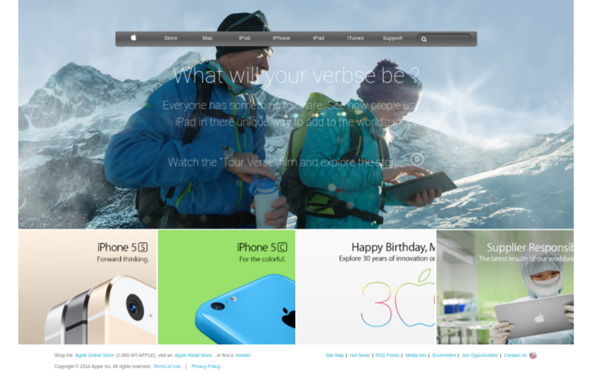

# apple.com  home page Clone

Clone of [https://apple.com home page](https://web.archive.org/web/20140301004610/http://www.apple.com/) for my first Microverse solo project included in the HTML & CSS course. 

## Built With

- HTML
- CSS

## Live Demo

[Live Demo Link](https://rawcdn.githack.com/Mikearaya/apple-clone/63bf0d8f41f9c43351a5cf3937199fa701ceb30c/index.html)

## Getting Started

To get a local copy up and running follow these simple example steps.
 - Clone or download this repository to your local workstation.

### Prerequisites
there are no prerequisits to run the project. but if you want to work on it make sure you have the following installed in your global evnviroment
  - [npm](https://www.npmjs.com/products/teams?utm_source=adwords&utm_medium=ppc&utm_campaign=npmTeams2019Q2&utm_content=site&gclid=Cj0KCQjwyPbzBRDsARIsAFh15JaJyPdeb-Q11Rq-LMaulSWINd6PYdJQ2OkZyE75reyBcpnnmwPrgRoaAv_5EALw_wcB)
  - [npx](https://www.npmjs.com/package/npx)
### Install

for development make sure you run the following command before you start working on the project
`npm install`
this will install all the packages used for development purpose, mainly `stylint`

### Usage
 enter the directory where you cloned or downloaded the project and open index.html file using your favorite browser
 
## Authors

👤 **Mikael Araya**

- Github: [@mikearaya](https://github.com/mikearaya)
- Twitter: [@mikearaya12](https://twitter.com/mikearaya12)
- Linkedin: [linkedin](https://linkedin.com/in/mikael-araya)

## 🤝 Contributing

Contributions, issues and feature requests are welcome!

Feel free to check the [issues page](issues/).

## Show your support

Give a ⭐️ if you like this project!

## 📝 License

This project is [MIT](lic.url) licensed.
